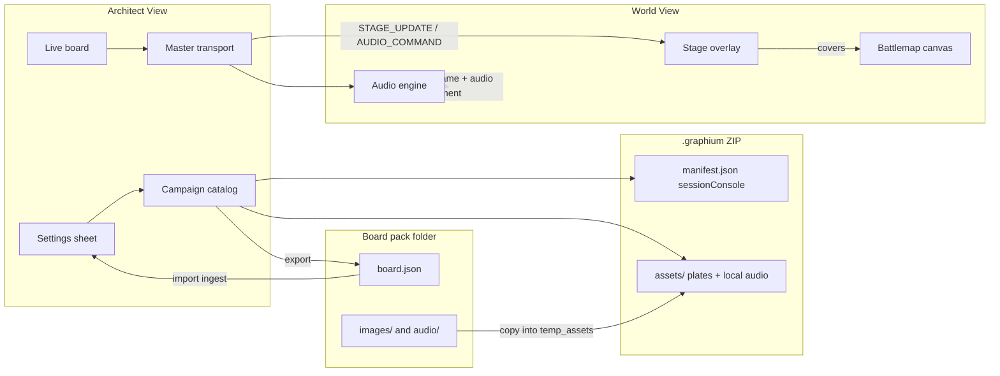

# Session Console Design

**Status:** Approved for planning (2026-09-04)
**Prototype:** [ash-crown `Campaign/Soundboard.html`](https://github.com/kocheck/ash-crown/blob/main/Campaign/Soundboard.html)
**Related:** [Implementation plan](./session-console-plan.md)

Graphium gains a campaign-native **Session Console**: a private Architect board for player-safe artwork and ambience, plus a World View **Stage** that Discord can share as a single window.

---

## Problem

The Ash Crown prototype already solves a real table problem:

- Show the party one plate at a time without leaking spoiler thumbnails or DM cue text.
- Play long YouTube ambient beds from the *same window* Discord captures.
- Keep soundtrack cues independent from image reveals so a combat track cannot flash the statue.
- Survive Discord/macOS audio flake with duck, test tone, and a “copy all links” fallback.

It does this as a hardcoded HTML file plus a Python server. Graphium already has the right dual-window shape. This feature ports the session-console *workflow* into the campaign file and the existing Architect / World pair.

---

## Locked decisions

| Decision | Choice |
| --- | --- |
| Player surface | **World View Stage mode.** A full-viewport overlay covers the battlemap. One Discord share target. “Return to map” dismisses the plate. |
| Audio sources | **YouTube and local files** (`mp3` / `ogg` / `wav` / `m4a`). YouTube for long beds; local files for reliability, offline, and one-shots. |
| Image vs audio | **Independent.** Showing a plate never starts a track. Playing a track never changes the plate. Tracks may *recommend* a plate; the DM still clicks. |
| Audio when returning to map | **Keep playing.** Dismissing Stage hides art only. `Stop` / `Esc` is the hard cut. |
| Config | **Settings sheet + live board.** Session time uses the sidebar board. Prep and bulk load live in a dedicated Session Console Settings space (not the app-wide wall/touch Preferences dialog). |
| Bulk load | **Board pack:** a `board.json` whose `src` strings are YouTube URLs, relative files, or http(s) files. Import **ingests** bytes into the campaign. We do not keep live links to random disk paths. |
| Scope of catalog | **Campaign-level**, not per-map. Image sets and track groups travel with the campaign the way `tokenLibrary` does. |
| Voice/chat | Still out of scope. Discord / Zoom remain the voice layer. This feature only produces *ambience and plates* for the shared World window. |

---

## What we keep from the prototype

These are product rules, not nostalgia:

1. **Private console / public stage.** Architect shows names, cues, spoiler thumbs, and recommended plates. World shows only the current plate (or the battlemap) and produces audio.
2. **Arm audio once** in World View so later remote play commands are not blocked by autoplay policy.
3. **Duck (`D`)** drops effective volume to ~27% of the slider for read-alouds.
4. **Transport:** play, pause, resume, restart, stop, volume, loop beds.
5. **Crossfade** on track change; fade out on stop; fade image on plate change.
6. **Number keys 1–9** play the first nine *visible* tracks in current board order. `Esc` stops.
7. **Built-in synth SFX + test tone** (no files required) so Discord capture can be verified before players arrive.
8. **Copy current / copy all YouTube links** for the mid-session fallback: paste into Discord and call the number.
9. **Staged reveal sets.** Session plates are grouped and ordered. World never receives unused set thumbnails.
10. **Discord setup checklist** in the console (Krisp off, attenuation 0%, share World View + include audio, test tone).

---

## Improvements over the prototype

| Prototype pain | Graphium version |
| --- | --- |
| Hardcoded Skeldra tracks and plates in HTML | Campaign-owned catalog + editor |
| Third popup + `python -m http.server` | Existing World window; production renderer must not stay on `file://` (YouTube Error 153) |
| Player View is *only* art | Stage covers the map, then drops away; music can sit under combat |
| Video IDs only | Paste a watch URL, shorts URL, or ID; store the canonical 11-char ID |
| One volume for every bed | Per-track volume offset on top of the master slider |
| Synth SFX only | Synth SFX stay; local audio clips can be one-shots or beds |
| No persistence | Saved in `.graphium` with other campaign assets |
| Cue text lives in the button markup | First-class `cue` / `recommendedImageId` fields |
| File-protocol banner and localhost ritual | Electron origin fix + a short “Arm World View” status in Architect |
| Editing HTML to add a session’s plates | Board pack import/export + Settings sheet |

Explicitly **not** in v1: stacked beds, Ken Burns, custom keybindings, auto-bind scenes, waveform UI, scraping `Soundboard.html`, or player-side volume (they already have Discord’s stream slider).

---

## User workflows

### Prep (Architect only)

**Fast path (recommended for a real session):** keep a folder next to your notes, then import it.

```
session-3-board/
  board.json
  images/breakfast.png
  audio/rain.mp3
```

1. Open **Session Console → Settings**.
2. **Import board pack** and pick `board.json` (Replace or Merge).
3. Graphium copies listed files into the campaign and turns YouTube strings into ids. Tweak cues in the editor if needed.
4. Save the campaign. The pack folder can stay in git; the `.graphium` is what you run at the table.

**Slow path:** add one plate or track from the Settings editor (file picker or paste a YouTube URL) without writing JSON.

**Export:** Settings → Export board pack writes a fresh folder (`board.json` + `images/` + `audio/`) so you can edit strings in a text editor and re-import.

### Session

1. Open World View. Click **Arm audio** on the World Stage gate (first time only).
2. Share the World window in Discord with **Include Audio**.
3. Hit **Test Tone**. One player confirms they hear it.
4. Click plates to reveal. Click tracks to change the bed. Duck when reading. Return to map when combat starts — music keeps going unless you stop it.

### Failure

If YouTube or Discord capture dies: **Copy all links**, paste into chat, call the number. Do not debug capture at the table.

---

## Information architecture



Two state planes:

- **Catalog** (persisted, Architect-edited): image sets, tracks, groups, SFX ids, stage chrome.
- **Runtime** (synced Architect → World, not a spoiler dump): whether Stage is up, which plate is showing, what is playing, volume, duck, one-shot ticks.

World never receives the full image-set gallery. It receives the *current* plate payload only.

---

## Data model

Add to [`Campaign`](../../src/store/gameStore.ts) alongside `tokenLibrary`:

```ts
interface Campaign {
  // existing fields...
  sessionConsole: SessionConsoleCatalog;
}

interface SessionConsoleCatalog {
  version: 1;
  stage: {
    title: string;       // default: campaign.name
    subtitle: string;    // optional line under the frame mark
    showFrame: boolean;  // brass frame / wash; default true
  };
  defaults: {
    volume: number;      // 0–100, default 45; seeds runtime.volume on load
    duckPercent: number; // 1–100, default 27; used by effectiveVolume
  };
  imageSets: ImageSet[];
  trackGroups: TrackGroup[];
  sfx: SfxDefinition[];  // v1 seeds the four synth types; local clips optional later
}

interface ImageSet {
  id: string;
  title: string;
  note: string;
  images: StageImage[];
}

interface StageImage {
  id: string;
  name: string;
  cue: string;           // DM-only
  src: string;           // file:// / later assets/ in the zip
  alt: string;           // player-safe alt text
}

interface TrackGroup {
  id: string;
  title: string;
  note: string;
  accent: 'bed' | 'road' | 'dread' | 'combat' | 'arrive';
  tracks: Track[];
}

interface Track {
  id: string;
  title: string;
  cue: string;
  tag: string;                 // short chip: "bed", "skirmish"
  source: 'youtube' | 'local';
  youtubeId?: string;          // 11-char id
  src?: string;                // local file:// asset
  volumeOffset: number;        // -30..30 added to master, then clamped 0..100
  loop: boolean;               // default true for beds
  recommendedImageId?: string;
}

interface SfxDefinition {
  id: string;
  label: string;
  kind: 'synth' | 'local';
  synthType?: 'chime' | 'drone' | 'snap' | 'ping' | 'test-tone';
  src?: string;
}
```

Runtime (top-level `GameState`, synced, not written as the source of catalog truth):

```ts
interface SessionConsoleRuntime {
  stageVisible: boolean;
  activeImage: { id: string; src: string; alt: string; name: string } | null;
  audio: {
    trackId: string | null;
    title: string;
    source: 'youtube' | 'local' | null;
    youtubeId: string | null;
    src: string | null;
    status: 'stopped' | 'playing' | 'paused';
    loop: boolean;
  };
  volume: number;          // 0–100, default 45
  ducked: boolean;
  sfxSeq: number;          // increment to fire a one-shot
  sfxId: string | null;
  worldArmed: boolean;     // last event from World; Architect status only
}
```

Legacy campaigns missing `sessionConsole` migrate to `emptySessionConsole(campaign.name)` with the four built-in synth SFX.

---

## Sync contract

Architect remains the producer. Extend [`SyncableGameState`](../../src/utils/syncUtils.ts) with `sessionConsoleRuntime` only — not the catalog.

New actions:

- `STAGE_UPDATE` — `{ stageVisible, activeImage }`
- `AUDIO_UPDATE` — transport snapshot (id, source, status, volume, ducked, loop)
- `SFX_FIRE` — `{ seq, sfxId }` (World plays once per new seq)

`FULL_SYNC` includes the runtime snapshot so a late World window can restore the current plate and bed.

World must **not** echo catalog edits. World may send a small status event (`SESSION_CONSOLE_WORLD_EVENT`: `ready` / `armed` / `unarmed` / `error`) so Architect can show the green/red arm state. That is the only World → Architect addition besides existing token x/y.

---

## Audio engine (World View)

A dedicated component, not Konva:

- Hidden YouTube IFrame API host (same approach as the prototype).
- `<audio>` element for local files, `src` converted with `toMediaProtocol()`.
- Web Audio synth for built-in SFX and the 3s test tone.
- Crossfade: fade current to 0 (~300ms), load next, fade in to `effectiveVolume` (~900ms).
- `effectiveVolume(volume, ducked, offset, duckPercent)` = clamp(volume + offset), then if ducked `round(clamped * duckPercent / 100)`. Default duck is 27.
- Loop: YouTube `ENDED` → seek 0 + play; local `loop` attribute.
- Architect never plays campaign audio. Preview-in-Architect is deferred (it would not be what Discord captures).

### YouTube + `file://` (blocking)

Production Electron currently does `loadFile(...)` for both windows ([`electron/main.ts`](../../electron/main.ts)). YouTube’s embedder check fails on `file://` with **Error 153** — the prototype already documents this.

v1 must load the renderer from a **non-file origin** in production. Preferred fix: register a privileged custom scheme (`graphium://`) and `loadURL('graphium://app/index.html?type=world')` (Architect too, same origin). Fallback if that fights the build: a loopback HTTP server in the main process.

Dev already uses `http://localhost:5173`, so YouTube works there today.

Local files do not need this; `media://` already serves sandboxed bytes.

---

## Authoring: board pack + Settings space

The in-app row editor is for tweaks. A 20-track session should start as a **board pack** — the same idea as the Ash Crown HTML, but as data.

### Why ingest, not live paths

Keeping `src: "/Users/you/Campaign/art.png"` in the campaign would break on the next machine, escape the `media://` sandbox, and make `.graphium` files non-portable. Import **copies** listed files into `temp_assets/` (then into the zip on save). After import, the catalog only stores campaign asset URLs plus YouTube ids.

YouTube is the exception: we store the 11-char id and stream via the IFrame API. We never download YouTube media.

### `src` resolution on import

Each image or track `src` string is classified once:

| String | Result |
| --- | --- |
| YouTube watch / shorts / youtu.be / embed / raw 11-char id | Track `source: 'youtube'` |
| Relative path (`./images/a.png`) | File must resolve **inside the pack folder**. Copied in. |
| Absolute file path | Allowed as a convenience; still copied in. Rejected if unreadable. |
| `http(s):` image or audio URL | Fetched once and ingested. Failed fetch skips that item with a toast. |
| Anything else | Validation error on that row; rest of the pack still imports. |

Relative paths are resolved against the directory that contains `board.json`. After `realpath`, the file must stay inside that directory (no `../.ssh`). Max audio size: 50MB. Images go through `processImage(..., 'MAP')`.

`recommendedImage` in the pack may be an image `id` or `name`; import maps it to `recommendedImageId`.

### Pack format

Kind: `graphium.sessionConsolePack`. Example: [`session-console-pack.example.json`](./session-console-pack.example.json).

On **export**, Graphium writes:

```
board/
  board.json          # YouTube srcs as full watch URLs; files as ./images/… and ./audio/…
  images/{id}.webp
  audio/{id}.mp3
```

That folder is git-friendly. Re-import after editing strings.

### Import modes (Settings)

- **Replace board** — confirm, then swap the catalog (runtime plate/audio cleared).
- **Merge** — append sets/groups; colliding ids get a new id; no silent overwrite.

### Electron vs web

- **Electron:** Settings opens `board.json` via a native dialog (`IMPORT_SESSION_CONSOLE_PACK`). Main process reads the JSON, sandboxes paths, copies files, returns a catalog with `file://` temp srcs.
- **Web:** JSON with YouTube + `http(s)` srcs works (fetch + ingest). Local relative files need a folder picker (`webkitdirectory`) or the user adds those files one-by-one. Do not pretend the browser can read arbitrary disk paths.

### Settings sheet (Architect)

Dedicated drawer, same pattern as [`MapSettingsSheet.tsx`](../../src/components/MapSettingsSheet.tsx). Do **not** dump this into [`PreferencesDialog.tsx`](../../src/components/PreferencesDialog.tsx) — those prefs are app-wide (walls, touch) and live in localStorage. Session Console config is campaign data.

Sections:

1. **Board pack** — Import (Replace / Merge), Export, last-import summary (N plates, N tracks, N skipped).
2. **Stage** — title, subtitle, show frame.
3. **Playback defaults** — default volume, duck percent.
4. **Edit catalog** — add/reorder/delete sets, plates, groups, tracks (file picker or paste URL). This is the slow path.
5. **Table setup** — Discord checklist + keyboard legend.

The sidebar stays the **live board** (play, reveal, duck). Settings is where you load and shape the board.

---

## UI

### Architect — Session Console

New sidebar section (same `CollapsibleSection` pattern as maps / library). Header includes **Settings**.

Master bar (always visible while the section is open):

- Connection / armed status
- Volume slider
- Duck, Pause, Resume, Restart, Stop
- Return to map
- Copy current / copy all links
- Test tone

Board:

- Image sets as thumbnail grids (active plate highlighted). Click = `showPlate`.
- Track groups as lists. Active track highlighted. Recommended plate shown as DM-only brass text, not applied.
- SFX grid.
- Empty state points at Settings → Import board pack.

Keyboard: 1–9, `D`, `Esc` when focus is not in an input. Register matching commands in [`commandRegistry.ts`](../../src/utils/commandRegistry.ts).

### World — Stage

Sibling of [`LoadingOverlay`](../../src/components/LoadingOverlay.tsx) in [`App.tsx`](../../src/App.tsx): `{isWorldView && <WorldStage />}`.

- `fixed inset-0`, below pause overlay (`z-[9998]`; pause stays `z-[9999]`).
- Current image, `object-fit: contain`, wash + optional frame + title/subtitle.
- Arm gate until armed (copy from prototype: “This window owns campaign audio”).
- Hidden audio hosts.
- Fade class on image change; ignore stale loads (latest-request gate).

Pause still covers Stage. Players should not see mid-prep plate swaps.

---

## Assets and save/load

- Plates: `processImage(file, 'MAP')` (4096px WebP). Rewrite `sessionConsole.imageSets[].images[].src` in [`rewriteCampaignAssetSrcs`](../../src/utils/campaignAssets.ts).
- Local audio: **do not** run `AssetProcessor`. Read the file as `ArrayBuffer` and `SAVE_ASSET_TEMP` with the original extension. Allow `mp3|ogg|wav|m4a` only. Rewrite `track.src` / local SFX `src` the same way.
- `media://` already `net.fetch`s the file; confirm audio MIME comes through. If Chromium sniffs wrong, set `Content-Type` from extension in the protocol handler.
- Allowed roots stay `temp_assets/`, `sessions/`, `library/`.

---

## Web build

Same React UI. YouTube works on GitHub Pages / localhost. Local audio uses the existing web storage adapter (blob / IndexedDB) via `rewriteCampaignAssetSrcs`. BroadcastChannel sync already used for two-tab World View must carry the new runtime actions.

---

## Privacy and spoilers

- World overlay copy is player-safe: image `alt` / `name` only. No cues, no “Reveal 5”, no recommended-plate text.
- Architect thumbs of unrevealed plates never leave Architect.
- Error toasts go through existing sanitizer paths. YouTube URLs are not PII, but file paths in errors must stay sanitized.

---

## Success criteria

A DM can, without editing HTML:

1. Import a board pack (`board.json` + relative files / YouTube URLs) from Settings, or add a single plate/track by hand.
2. Export that board back out as a folder, edit a URL in the JSON, and merge it again.
3. Arm World View, share that window, and have a player hear the test tone while seeing only the current plate.
4. Reveal plates in order without music changing the picture.
5. Drop Stage and keep the bed under the battlemap.
6. Duck, stop, and recover via copied links.
7. Reload the campaign and get the same catalog (ingested assets, not original disk paths).

---

## Open follow-ups (not v1)

- Architect-only headphone preview (would play in the wrong window for Discord).
- One-click importer that scrapes Ash Crown `Soundboard.html` (a hand-written board pack is the supported path).
- Multiple simultaneous layers (bed + sting).
- Per-map “default plate” when switching maps.
